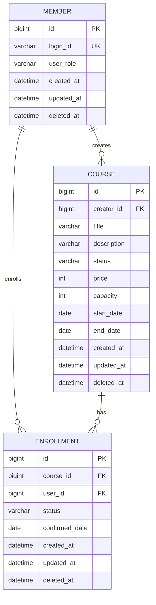

# 데이터 모델 설명

LiveKlass의 핵심 데이터 모델은 사용자(`member`), 강의(`course`), 수강 신청(`enrollment`) 세 가지입니다.

현재 구현에서는 JPA `@ManyToOne` 같은 객체 연관관계를 직접 맺지 않고, `creatorId`, `courseId`, `userId`처럼 식별자 컬럼으로 참조합니다. 도메인 로직은 Facade와 Service에서 필요한 엔티티를 명시적으로 조회해 조합합니다.

## ERD 개요

## 공통 컬럼

모든 엔티티는 `BaseEntity`를 상속합니다.

| 컬럼 | 타입 | 설명 |
| --- | --- | --- |
| `id` | `BIGINT` | 기본 키, auto increment |
| `created_at` | `DATETIME` | 생성 일시 |
| `updated_at` | `DATETIME` | 수정 일시 |
| `deleted_at` | `DATETIME` | 삭제 일시, soft delete를 고려한 컬럼 |

`created_at`, `updated_at`은 JPA lifecycle callback을 통해 저장/수정 시 자동으로 설정됩니다.

## 사용자(member)

서비스를 이용하는 사용자를 나타냅니다. 사용자는 강사 또는 수강생 역할을 가집니다.

| 컬럼 | 타입 | 제약 | 설명 |
| --- | --- | --- | --- |
| `id` | `BIGINT` | PK | 사용자 ID |
| `login_id` | `VARCHAR(100)` | NOT NULL, UNIQUE | 로그인 ID |
| `user_role` | `VARCHAR(20)` | NOT NULL | 사용자 역할 |

### 사용자 역할

| 값 | 설명 |
| --- | --- |
| `CREATOR` | 강의를 등록하고 모집 상태를 변경할 수 있는 강사 |
| `STUDENT` | 강의에 수강 신청할 수 있는 수강생 |

## 강의(course)

강사가 개설한 강의를 나타냅니다.

| 컬럼 | 타입 | 제약 | 설명 |
| --- | --- | --- | --- |
| `id` | `BIGINT` | PK | 강의 ID |
| `creator_id` | `BIGINT` | NOT NULL | 강의를 생성한 사용자 ID |
| `title` | `VARCHAR` | NOT NULL | 강의 제목 |
| `description` | `VARCHAR` | NOT NULL | 강의 설명 |
| `status` | `VARCHAR` | NOT NULL | 강의 상태 |
| `price` | `INT` | NOT NULL | 강의 가격 |
| `capacity` | `INT` | NOT NULL | 최대 수강 가능 인원 |
| `start_date` | `DATE` | NOT NULL | 수강 시작일 |
| `end_date` | `DATE` | NOT NULL | 수강 종료일 |

### 강의 상태

| 값 | 설명 | 수강 신청 가능 여부 |
| --- | --- | --- |
| `DRAFT` | 초안 상태 | 불가 |
| `OPEN` | 모집 중 | 가능 |
| `CLOSED` | 모집 마감 | 불가 |

### 강의 제약

- `creator_id`는 양수여야 합니다.
- `title`, `description`은 비어 있을 수 없습니다.
- `price`는 0 이상이어야 합니다.
- `capacity`는 1 이상이어야 합니다.
- `end_date`는 `start_date`와 같거나 이후여야 합니다.
- 강의 생성 시 상태는 항상 `DRAFT`입니다.

## 수강 신청(enrollment)

수강생이 특정 강의에 신청한 내역을 나타냅니다.

| 컬럼 | 타입 | 제약 | 설명 |
| --- | --- | --- | --- |
| `id` | `BIGINT` | PK | 수강 신청 ID |
| `course_id` | `BIGINT` | NOT NULL | 신청한 강의 ID |
| `user_id` | `BIGINT` | NOT NULL | 신청한 수강생 ID |
| `status` | `VARCHAR(20)` | NOT NULL | 수강 신청 상태 |
| `confirmed_date` | `DATE` | NULL | 결제 확정일 |

### 수강 신청 상태

| 값 | 설명 |
| --- | --- |
| `PENDING` | 수강 신청 완료, 결제 대기 |
| `CONFIRMED` | 결제 완료, 수강 확정 |
| `CANCELLED` | 수강 신청 취소 |

### 수강 신청 제약

- `course_id`, `user_id`는 양수여야 합니다.
- 수강 신청 생성 시 상태는 항상 `PENDING`입니다.
- `PENDING` 상태의 신청만 `CONFIRMED`로 변경할 수 있습니다.
- 결제 확정 시 `confirmed_date`에 현재 날짜를 저장합니다.
- 이미 `CANCELLED` 상태인 신청은 다시 취소할 수 없습니다.
- `CONFIRMED` 상태의 신청은 결제 확정일 기준 7일 이내에만 취소할 수 있습니다.

## 관계 설명

### 사용자와 강의

- 한 명의 `CREATOR`는 여러 개의 강의를 생성할 수 있습니다.
- 강의는 `creator_id`로 생성자를 참조합니다.
- 강의 등록, 모집 시작, 모집 마감 시 요청 사용자와 `creator_id`를 비교해 소유권을 검증합니다.

### 사용자와 수강 신청

- 한 명의 `STUDENT`는 여러 강의에 수강 신청할 수 있습니다.
- 수강 신청은 `user_id`로 신청자를 참조합니다.
- 내 수강 신청 목록은 `user_id` 기준으로 조회합니다.

### 강의와 수강 신청

- 하나의 강의에는 여러 수강 신청이 연결될 수 있습니다.
- 수강 신청은 `course_id`로 강의를 참조합니다.
- 강의의 현재 신청 인원은 해당 강의의 `PENDING`, `CONFIRMED` 상태 수강 신청 수로 계산합니다.
- 강의별 수강생 목록은 해당 강의의 `CONFIRMED` 상태 수강 신청만 조회합니다.

## 정원 계산 기준

정원 계산에 포함되는 상태는 다음과 같습니다.

| 상태 | 정원 계산 포함 여부 | 이유 |
| --- | --- | --- |
| `PENDING` | 포함 | 결제 대기 중인 신청도 자리를 점유한다고 해석 |
| `CONFIRMED` | 포함 | 결제가 완료된 확정 수강생 |
| `CANCELLED` | 제외 | 취소된 신청은 자리를 점유하지 않음 |

수강 신청 시 강의 row에 비관적 쓰기 락을 획득한 뒤 현재 신청 인원을 계산합니다. 이를 통해 동시에 여러 요청이 들어와도 최종 신청 수가 강의 정원을 초과하지 않도록 제어합니다.
